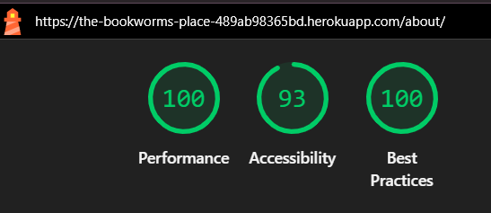
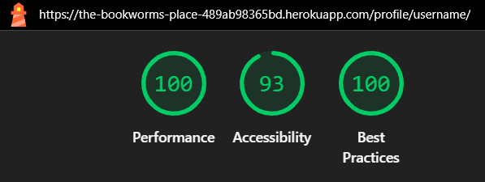

## 12. Validation
[Back To The Top](#table-of-contents)
### HTML

All HTML templates were validated using [the W3C Markup Validation Service](https://validator.w3.org/).
- All files passed validation except for a few minor issues:
  - height="35px" and width="35px" on  tags caused errors. These were corrected by removing the px unit (e.g., height="35").
  - A self-closing   tag was corrected to   to conform with HTML5 syntax.
- All other errors or warnings were related to Django template tags (e.g., ), which are not valid HTML but do not affect actual browser rendering. These were ignored during validation.

### CSS

The CSS file went through [the W3C CSS Validator](https://jigsaw.w3.org/css-validator/) without showing any errors. 

### JavaScript

The JavaScript code in this project was validated using [JSHint](https://jshint.com/). 
No critical errors were found. Some warnings were reported due to the use of ES6 syntax, including:
const and let declarations
Arrow functions (=>)

These are standard features in modern JavaScript and are fully supported in all modern browsers.
To suppress these warnings, the following directive can be added at the top of JavaScript files:
/* jshint esversion: 6 */

The JavaScript functionality in the project includes:
- A script to toggle the visibility of reply forms for comments on the book detail page.
- A script to handle interactive star rating submission for books.

These scripts were written with support from ChatGPT (OpenAI).

### Python

Python code was checked using `flake8` to ensure compliance with PEP 8 standards.  
Minor style warnings (e.g. line length) were adjusted or ignored when not critical.  
All functional code passes validation and runs without syntax errors.

In addition, automated tests were implemented and passed for key views and forms.

## 13. Lighthouse Testing
[Back To The Top](#table-of-contents)

Lighthouse was used to evaluate performance, accessibility, and best practices across all pages on both mobile and desktop.

All pages (except Admin Dashboard, Books and Books_details) had between 90 and 100 on Performance, Accessibility and Best Practice. Some changes were made on Admin Dashboard, Books and Book-details, see below

Some of the changes made were:
- Compressing and optimizing images
- Adding `aria-labels` to buttons and icons
- Preloading the hero image for faster loading
- Improving text contrast and focus order

Some issues related to third-party services (such as Cloudinary cookies) and certain design choices (like visual contrast vs. aesthetics) could not be fully resolved without compromising the user experience or layout.

### Desktop

  

  
Home Page

  
  

  

  
Books Page

  
  

  

  
Book details Page

  
  

  

  
About Page

  
  

  

  
Create Account Page

  
  

  

  
Login Page

  
  

  

  
Logout Page

  
  

  

  
My Profile Page

  
  

  

  
My Profile - Change Username Page

  
  

  

  
My Profile - Change Email Page

  
  

  

  
My Profile - Change Password Page

  
  

  

  
Admin Dashboard Page

  
  

  

  
Admin Dashboard - Add Book Page

  
  

  

  
Admin Dashboard - Edit Book Page

  
  

  

  
Admin Dashboard - Delete Book Page

  
  

  

  
Admin Dashboard - Edit About Page text

  
  

### Mobile

  

  
Home Page

  
  

  

  
Books Page

  
  

  

  
Book details Page

  
  

  

  
About Page

  
  

  

  
Create Account Page

  
  

  

  
Login Page

  
  

  

  
Logout Page

  
  

  

  
My Profile Page

  
  

  

  
My Profile - Change Username Page

  
  

  

  
My Profile - Change Email Page

  
  

  

  
My Profile - Change Password Page

  
  

  

  
Admin Dashboard Page

  
  

  

  
Admin Dashboard - Add Book Page

  
  

  

  
Admin Dashboard - Edit Book Page

  
  

  

  
Admin Dashboard - Delete Book Page

  
  

  

  
Admin Dashboard - Edit About Page text

  
  
